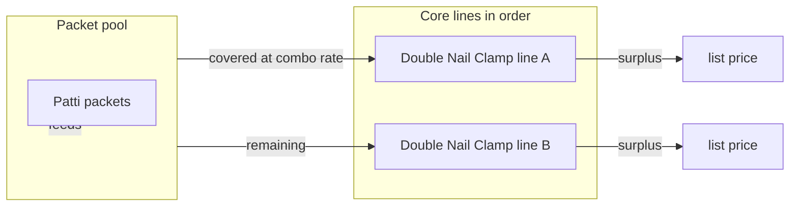

# Cart combo pricing (Patti + Double Nail Clamp) — how it works

This document explains **how combo pricing is calculated** when a customer has **Single Cable Nail Clips (Patti)** and **Double Nail Clamp** products in the cart. It matches the implementation in `lib/combo/resolveCartComboPricing.ts` and the client sync in `app/components/CartPage/ComboCartPricingSync.tsx`.

---

## 1. The idea in one paragraph

**Patti** products add **packets** to a shared **pool**. **Core** products (Double Nail Clamp–style slugs) **use** that pool: up to the pool size, each core packet can be priced at the **combo net rate** (instead of the normal list rate). If there are more core packets than the pool allows, the **extra** packets stay at **list** price. Patti lines themselves are **not** discounted by this combo—they only **fund** the pool.

---

## 2. Who is “Patti” and who is “Core”?

The server does **not** rely on exact product titles. It classifies each cart line using the **resolved slug** (see §4):

| Role   | Rule (substring on lowercase slug) | Typical catalog examples                          |
|--------|-------------------------------------|---------------------------------------------------|
| **Patti** (pool supplier) | Slug **contains** `cable-nail`     | `cable-nail-clips`, variants of Single Cable Nail |
| **Core** (pool consumer)  | Slug **contains** `nail-clamp`      | `double-nail-clamp`, `double-nail-clamps`, etc.  |

**Note:** `cable-nail-clips` matches Patti (`cable-nail`) but does **not** match Core (`nail-clamp`), because the substring `nail-clamp` does not appear in that slug.

Anything that is **neither** Patti nor Core by these rules is a **normal** line: full list pricing, no combo flag.

---

## 3. How “packets” are counted per line

Combo math is done in **packets** (same unit on both sides of the pool).

### Order modes

- **`packets`** — `quantity` is the number of **loose packets** on that line.
- **`master_bag`** — `quantity` is the number of **bags**; each bag is expanded to a number of packets (see below).

### Non-Patti products

For products that are **not** classified as Patti by slug:

```
totalPackets = (bags × packetsPerBag) + loosePackets
```

Here **`packetsPerBag`** is resolved from the database when possible (`size` row → `product.packaging` → client `qtyPerBag`). See `resolveDbPacketsPerBag` in `resolveCartComboPricing.ts`.

### Patti products (special case)

For lines whose slug matches **Patti** (`cable-nail`), the code uses a **fixed** packets-per-bag for bags:

```
totalPackets = (bags × 750) + loosePackets
```

So for Patti in **master_bag** mode, **750 packets per bag** is used regardless of what the DB says for other products. Loose packets still use `quantity` directly when mode is `packets`.

This keeps the “Patti pool” aligned with how RPT treats that SKU for combo testing/list alignment.

---

## 4. Where the slug comes from

Each line gets a single lowercase string used for matching:

1. **`productSlug` from the client** (if sent) — preferred when Mongo’s `product.slug` is missing or wrong.
2. Else **`product.slug` from Mongo** (when the line has a valid `mongoProductId` and the product was loaded).

Function: `resolveSlugForLine` in `resolveCartComboPricing.ts`.

The cart API accepts **`productSlug`** in each line object; see `parseLines` in `app/api/cart/combo-pricing/route.ts`. The React cart sends it via `ComboCartPricingSync` (`linesPayload` includes `productSlug`).

---

## 5. Building the pool and “how much core needs”

After every line is prepared (slug + `totalPackets` + list prices):

1. **`pattiAvailable`** = sum of `totalPackets` for all lines where the slug is **Patti**.
2. **`coreNeeded`** = sum of `totalPackets` for all lines where the slug is **Core**.

These totals are what you see in server logs as **“Final Match Check”** (Patti available vs Core needed). They describe **supply** and **demand** in packet units, before allocation.

---

## 6. Allocating the pool to Core lines (the matcher)

The server walks **`prepared` lines in order**. It keeps a running **`pool`**, initialized to **`pattiAvailable`**.

For each line:

- If it is **not** Core → charged at **list** price for all its packets (no combo on that line). Pool unchanged.
- If it **is** Core and combo is **not** skipped (see §9):
  - **`covered`** = `min(corePacketsOnThisLine, pool)` — how many packets on **this** line get the combo rate.
  - **`pool`** -= `covered`
  - **`surplus`** = core packets on this line minus `covered` — priced at **list**.

So allocation is **first-come-first-served** in the order of lines in `prepared`. If you add multiple Core lines, earlier lines consume the pool first.

---

## 7. Combo price constants (Double Nail Clamp 20 mm style)

When combo applies to covered core packets, the **per-packet** prices used are:

| Meaning              | Constant / source |
|----------------------|-------------------|
| Combo incl. GST      | `RPT_FALLBACK_DNC_20MM_COMBO_WITH_GST` = **59.35** |
| Combo ex-GST (basic) | `RPT_FALLBACK_DNC_20MM_COMBO_BASIC` = **50.30** |

Defined in `lib/b2b/combo-logic.ts` and referenced in `resolveCartComboPricing.ts` as `COMBO_UNIT_INCL_GST` / `COMBO_UNIT_BASIC`.

These match the published **Single Clip 20 mm COMBO** row when the DB does not override combo columns for that line.

**Line total for a Core line** (incl. GST):

```text
lineInclTotal = covered × 59.35 + surplus × listGst
```

Same idea for basic (ex-GST) with `listBasic` on the surplus part.

**Savings** (for reporting): for each covered packet, roughly `listGst − 59.35`, summed across covered packets.

---

## 8. What the API returns per line (`isComboApplied`, unit price)

For **Core** lines where **`covered > 0`**:

- **`isComboApplied`** = `true`
- **`comboPricedPackets`** = `covered`
- **`comboSubtotalInclGst`** = `covered × 59.35` (rounded)
- **`pricePerUnit` / `basicPricePerUnit`** are **blended** so that:
  - `pricePerUnit × packetCount ≈ lineInclTotal` (same for basic vs line basic total)

So if **some** packets are combo and **some** are list on the same line, the **displayed unit price** is the **weighted average**, not always exactly 59.35. When **all** core packets on the line are combo-priced, the blended unit equals **59.35** incl. GST.

For Core lines with **no** coverage (`covered === 0`), list prices apply and **`isComboApplied`** is false.

---

## 9. When combo is turned off on purpose

The POST body can include **`preferListOverCombo: true`** (used when coupon mode is “use list for full coupon”). The API passes **`skipComboAllocation: true`** into `resolveCartComboPricing`. Then Core lines are **never** allocated combo rates—they behave like list-only for that request.

---

## 10. Smart suggestion text

If **`coreNeeded > pattiAvailable`** and there is at least some core demand, the API returns a **`smartSuggestion`** string suggesting the user add more Patti packets to unlock more combo-priced Core quantity. The exact wording is built in `resolveCartComboPricing.ts`.

---

## 11. Minimum order

The route **`app/api/cart/combo-pricing/route.ts`** also loads **`minimumOrderInclGst`** from app settings and sets **`minimumOrderMet`** when `result.cartTotalInclGst >= minimumOrderInclGst`. That flag is independent of combo math but shipped in the same response for the UI.

---

## 12. Client: applying prices back to the cart

`ComboCartPricingSync`:

1. POSTs all cart lines (including **`productSlug`**, quantities, modes, prices) to `/api/cart/combo-pricing`.
2. On success, calls **`applyComboPricingLines`** with each row’s `key`, unit prices, combo packet counts, and combo flags.
3. **`isComboApplied`** on the client also treats **`comboPricedPackets > 0`** or **`comboSubtotalInclGst`** as a signal if the boolean is missing—so the badge logic stays robust.

---

## 13. Relationship to `computeComboPricing.ts`

`lib/combo/computeComboPricing.ts` implements a **more generic** combo allocator (pool keys, DB combo columns, `augmentRptB2bComboLine`, etc.). The **live cart API path** uses **`resolveCartComboPricing`** instead, with the **substring slug rules** and **Patti 750** behavior described above. Both share **type names** like `ComboPricingResult`, but the cart resolver is the source of truth for **combo-pricing API** behavior.

---

## 14. Debugging (server logs)

During development you may see:

- **`Current Cart Slugs:`** — `productSlug` from each incoming line (helps verify the client payload).
- **`Final Match Check -> Patti Available: […], Core Needed: […]`** — pool totals before per-line allocation.

Remove or gate these for production if you want a quiet log.

---

## 15. Quick mental model (mermaid)



---

## 16. File map

| Area | File |
|------|------|
| Core algorithm | `lib/combo/resolveCartComboPricing.ts` |
| Fallback rates & PDF reference comment | `lib/b2b/combo-logic.ts` |
| Generic combo engine (not the cart POST path) | `lib/combo/computeComboPricing.ts` |
| HTTP API | `app/api/cart/combo-pricing/route.ts` |
| Cart sync | `app/components/CartPage/ComboCartPricingSync.tsx` |
| Packet / order mode helpers | `lib/cart/packetLine.ts` |

---

*Last updated to reflect the slug rules (`cable-nail` / `nail-clamp`), Patti 750 bag rule, and blended Core unit pricing.*
